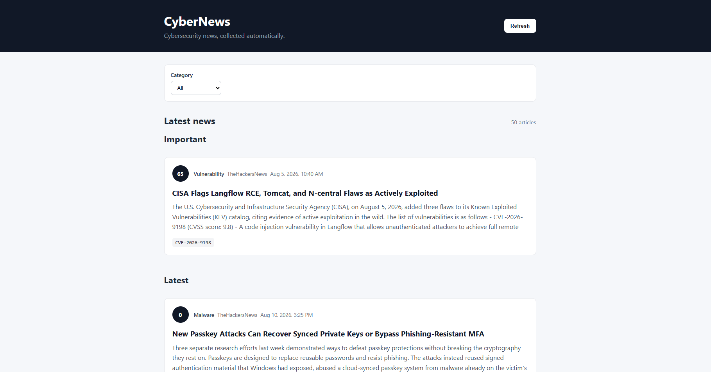
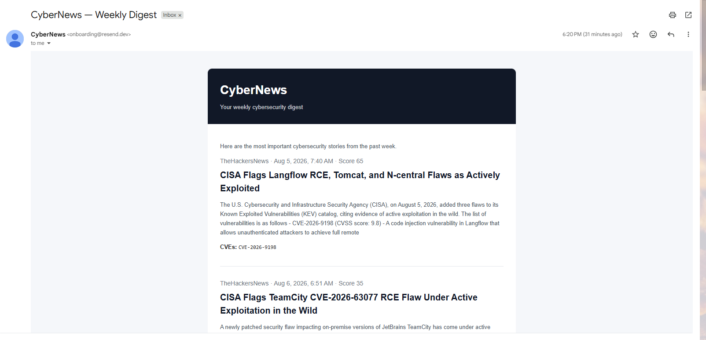

# CyberNews

> An automated cybersecurity news aggregation and intelligence dashboard.

CyberNews collects cybersecurity news from trusted sources, normalizes and enriches the articles, assigns an importance score and presents the latest stories through a lightweight web dashboard.

---

## Features

- Automated news collection from configurable cybersecurity sources
- Scheduled fetching through GitHub Actions
- URL canonicalization and duplicate detection
- Article normalization and summary cleaning
- Automatic categorization
- Article importance scoring
- CVE extraction
- Responsive web dashboard
- Weekly cybersecurity digest via e-mail
- Dropbox-backed persistence
- Automatic historical data cleanup
- Automated tests
-  Serverless deployment through Netlify

---

## Screenshots

### Dashboard





### Weekly e-mail digest



---

# Architecture

```text
                         ┌─────────────────────┐
                         │    Trusted Sources  │
                         │                     │
                         │  The Hacker News    │
                         │  BleepingComputer   │
                         │  SecurityWeek       │
                         │  ...                │
                         └──────────┬──────────┘
                                    │
                                    │ RSS / HTTP
                                    ▼
                         ┌─────────────────────┐
                         │   GitHub Actions    │
                         │                     │
                         │   fetch-news.yml    │
                         └──────────┬──────────┘
                                    │
                                    ▼
                         ┌─────────────────────┐
                         │   Processing Layer  │
                         │                     │
                         │ Normalize           │
                         │ Categorize           │
                         │ Extract CVEs        │
                         │ Score importance     │
                         └──────────┬──────────┘
                                    │
                                    ▼
                         ┌─────────────────────┐
                         │       Dropbox       │
                         │                     │
                         │ /articles/*.jsonl   │
                         └──────────┬──────────┘
                                    │
                                    │
                    ┌───────────────┴────────────────┐
                    │                                │
                    ▼                                ▼
          ┌──────────────────┐             ┌──────────────────┐
          │     Netlify      │             │  Weekly Digest   │
          │                  │             │                  │
          │ Web Dashboard    │             │ GitHub Actions   │
          │ /api/news        │             │       ↓          │
          │ Serverless API   │             │ Netlify Function │
          └────────┬─────────┘             │       ↓          │
                   │                       │     Resend       │
                   ▼                       └────────┬─────────┘
             ┌────────────┐                         │
             │   Browser  │                         ▼
             └────────────┘                       📧
```

The project deliberately uses managed/serverless components rather than maintaining a continuously running backend.

| Component | Responsibility |
|---|---|
| **GitHub Actions** | Scheduled data collection and maintenance |
| **Netlify** | Web hosting and serverless API functions |
| **Dropbox** | Persistent article storage |
| **Resend** | Email delivery |
| **Python** | News ingestion and processing |
| **JavaScript** | Web frontend and Netlify functions |

This keeps the operational footprint extremely small and makes the project inexpensive to run.

# Project Structure

```text
Cybernews/
│
├── .github/
│   └── workflows/
│       ├── fetch-news.yml
│       ├── weekly-digest.yml
│       └── cleanup-news.yml
│
├── netlify/
│   └── functions/
│       ├── news.mjs
│       ├── send-digest.mjs
│       └── cleanup-news.mjs
│
├── scripts/
│   └── fetch_news.py
│
├── src/
│   └── cybernews/
│       ├── models/
│       │   └── ...
│       │
│       ├── processing/
│       │   ├── normalize.py
│       │   ├── scoring.py
│       │   └── ...
│       │
│       ├── sources/
│       │   └── ...
│       │
│       └── storage/
│           ├── articles.py
│           └── dropbox.py
│
├── tests/
│   └── ...
│
├── web/
│   ├── index.html
│   ├── app.js
│   ├── styles.css
│   └── favicon.svg
│
├── docs/
│   └── images/
│       ├── dashboard.png
│       └── weekly-digest.png
│
├── netlify.toml
├── pyproject.toml
├── package.json
└── README.md
```

---

# Getting Started

## Requirements

- Python 3.11+
- Node.js 20+
- A Dropbox account
- A Dropbox API application
- A Netlify account
- A GitHub repository
- A Resend account for email delivery

---

## 1. Clone the repository

```bash
git clone https://github.com/<your-username>/Cybernews.git
cd Cybernews
```

--- 

## 2. Create the Python environment

### Windows

```powershell
python -m venv .venv
.venv\Scripts\Activate.ps1
```

### Linux / macOS

```bash python3 -m venv .venv
source .venv/bin/activate
```

Install the project:

```bash
pip install -e .
```

Install development dependencies if configured:

```bash 
pip install -e ".[dev]"
```

---

# Configuration

CyberNews uses environment variables for credentials and deployment-specific configuration.

Create a local `.env` file for development:

```env
DROPBOX_APP_KEY=...
DROPBOX_APP_SECRET=...
DROPBOX_REFRESH_TOKEN=...
DROPBOX_ROOT=

RESEND_API_KEY=...
DIGEST_RECIPIENT=...
DIGEST_FROM=...
```

### Environment variables

| Variable | Required | Description |
|---|---:|---|
| `DROPBOX_APP_KEY` | Yes | Dropbox application key |
| `DROPBOX_APP_SECRET` | Yes | Dropbox application secret |
| `DROPBOX_REFRESH_TOKEN` | Yes | Long-lived Dropbox refresh token |
| `DROPBOX_ROOT` | No | Optional Dropbox root path |
| `RESEND_API_KEY` | For email | Resend API key |
| `DIGEST_RECIPIENT` | For digest | Current digest recipient |
| `DIGEST_FROM` | Production email | Verified sender address |

---

# Dropbox Storage

Dropbox currently acts as the application's lightweight database.

The expected structure is:

```text
/
├── articles/
│   ├── 2026-08-10.jsonl
│   ├── 2026-08-09.jsonl
│   └── ...
│
└── subscribers/
    └── subscribers.json
```

Articles are stored as JSON Lines rather than as one large JSON document.

For example:

```json
{"id":"...","title":"...","url":"...","source":"The Hacker News","published_at":"..."}
{"id":"...","title":"...","url":"...","source":"BleepingComputer","published_at":"..."}
```

This keeps daily writes simple and makes historical cleanup straightforward.

---

# Adding a News Source

News sources are designed to be extendable.

A new source should generally:

1. Fetch the source's feed/API.
2. Convert the source-specific representation into `RawArticle`.
3. Return a list of `RawArticle` objects.
4. Let the shared processing pipeline normalize them.

Conceptually:

```text
Source
  │
  ▼
RawArticle
  │
  ▼
normalize()
  │
  ├── canonicalize URL
  ├── clean summary
  ├── classify
  ├── extract CVEs
  └── calculate importance
  │
  ▼
Article
  │
  ▼
Repository
```

This is intentional: **source-specific code should not contain business logic that belongs to the processing layer.**

---

# Article Processing

The processing pipeline transforms a `RawArticle` into the application's canonical `Article` model.

The basic pipeline is:

```python
article = Article(
    id=article_id(raw.url),
    title=raw.title,
    url=canonicalize_url(raw.url),
    source=raw.source,
    published_at=raw.published_at,
    fetched_at=datetime.now(timezone.utc),
    summary=clean_summary(raw.summary),
    category=classify(...),
    importance_score=score_article(...),
    cves=extract_cves(...)
)
```

This separation makes it possible to improve individual processing stages without changing the ingestion code.

---

# Importance Scoring

Every article receives an `importance_score`.

The score is intentionally implemented as a separate component so the ranking strategy can evolve independently from ingestion.

Possible signals include:

- CVE presence
- CVSS severity
- active exploitation
- ransomware involvement
- zero-day status
- CISA KEV inclusion
- affected product popularity
- number of independent sources reporting the story
- source reliability
- recency
- potential impact

The current scoring implementation should be considered a **heuristic**, not an objective measure of real-world severity.

### Future scoring model

A more sophisticated system could eventually use:

```text
importance =
    severity
    + exploitation
    + affected_population
    + source_confidence
    + cross_source_confirmation
    + recency
```

An ML/LLM-assisted ranking model could be introduced later without changing the storage or frontend layers.

---

# CVE Extraction

The processing layer extracts CVE identifiers from article metadata.

For example:

```text
CVE-2026-12345
CVE-2026-54321
```

These are stored directly on the normalized article.

This allows the frontend to eventually provide:

- CVE filtering
- CVE pages
- vulnerability timelines
- related articles
- severity dashboards

---

# Web Application

The frontend is intentionally lightweight.

The browser communicates with the Netlify function:

```text
GET /api/news
```

The function retrieves the appropriate article data from Dropbox and returns JSON.

The frontend then:

```text
API response
     ↓
loadNews()
     ↓
renderArticles()
     ↓
createArticleCard()
```

This keeps the frontend independent of Dropbox credentials.

**!Dropbox credentials must never be exposed to the browser!**

---

# Weekly Digest

The weekly digest is generated automatically.

The current workflow is:

```text
Sunday
   │
   ▼
GitHub Actions
   │
   ▼
POST /send-digest
   │
   ▼
Read recent articles
   │
   ▼
Rank by importance
   │
   ▼
Select top stories
   │
   ▼
Generate HTML email
   │
   ▼
Resend
   │
   ▼
📧 Recipient
```

The digest currently uses the highest-scoring articles from the previous week.

---

# Testing

Run the complete Python test suite:

```bash
pytest
```

Tests cover components such as:

- Dropbox storage
- article persistence
- normalization
- source ingestion
- processing
- article models

---

# Extending the Application

CyberNews is deliberately structured so that the major components can evolve independently.

## Add a new news source

Add a source implementation under:

```text
src/cybernews/sources/
```

---

## Change article scoring

Modify:

```text
src/cybernews/processing/scoring.py
```

The ingestion and storage layers should not need to change.

---

## Add a category

Update the classification logic and, if necessary, the `Article` model.

Then update frontend filters.

---

## Add a new metadata field

For example:

```text
affected_products
```

The change should propagate through:

```text
RawArticle
    ↓
Article
    ↓
storage
    ↓
API
    ↓
frontend
```

Add tests before changing the persisted representation.

---

## Replace Dropbox

Dropbox is intentionally isolated behind a storage abstraction.

The application could eventually move to:

- PostgreSQL
- SQLite
- Supabase
- Turso
- Firebase
- S3-compatible object storage

without requiring the news processing layer to know how persistence works.

The important boundary is:

```text
Application
     │
     ▼
Repository / Storage abstraction
     │
     ▼
Dropbox
```

---


# Potential future improvements

### High priority

- [ ] Multiple email subscribers
- [ ] Subscription confirmation
- [ ] Unsubscribe links
- [ ] Search
- [ ] Category filtering
- [ ] Source filtering
- [ ] Better importance scoring
- [ ] Article deduplication across sources

### Intelligence

- [ ] Story clustering
- [ ] Cross-source correlation
- [ ] AI-generated summaries
- [ ] AI-generated weekly briefing
- [ ] CVE enrichment
- [ ] CISA KEV integration
- [ ] CVSS enrichment
- [ ] Exploitation tracking

### UI

- [ ] Dark mode
- [ ] Article search
- [ ] Saved articles
- [ ] Vulnerability dashboard
- [ ] Source statistics
- [ ] Trending topics
- [ ] Mobile optimization

### Infrastructure

- [ ] Better observability
- [ ] Error reporting
- [ ] Retry handling
- [ ] Rate limiting
- [ ] Production email domain
- [ ] Database migration if article volume increases

--- 

# Project Status

CyberNews is currently under active development.

The core ingestion → processing → storage → API → dashboard pipeline is operational, with automated weekly email delivery and scheduled data cleanup.

The architecture is intentionally modular so that additional sources, intelligence features, storage providers and delivery mechanisms can be introduced without rewriting the core application.